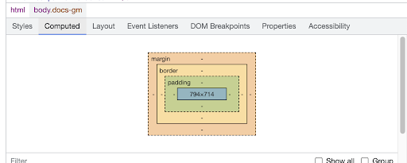

# M2-L2: CSS Basics

The goal of this lab is to help you familiarize yourself with CSS. We will be using a minimal HTML boilerplate and focusing mainly on CSS. Each section of these instructions corresponds to one `<article>` within the provided HTML. Your goal is to add and edit `index.css` to style the content in `index.html`.

**TIP:** To comment out a line of code in VS Code, you can use <kbd>Ctrl</kbd> + <kbd>/</kbd> (or <kbd>Cmd</kbd> + <kbd>/</kbd> on MacOS). ⌨️

**TIP:** You can repeat the same CSS rule multiple times, and only the last one defined will apply. For example, the final margin here will be `30px`:

```css
.class {
  margin: 20px;
  margin: 10px;
  margin: 30px;
}
```

---

## I. Selectors and Combinators

For more information, see the [MDN documentation on CSS Selectors](https://developer.mozilla.org/en-US/docs/Web/CSS/CSS_Selectors).

### 1. Selectors

1.  Using the **type** selector, add a `margin`, `padding`, and `border` to each `<article>` on the page. For example:
    ```css
    margin: 20px 0;
    padding: 20px;
    border: 1px solid black;
    ```
2.  Using a **class** selector, change the `color` of the element with the class `.style-me1` to **red**.
3.  Using an **ID** selector, change the `color` of the element with the ID `#style-me2` to **blue**.
4.  Using a **compound** selector, change the `color` of the element that has both a class of `.style-me1` and an ID of `#style-me2` to **purple**.

**NOTE:** In normal situations, duplicate IDs on the same page are a mistake. We are only doing it here for the simplicity of the exercise.

### 2. Combinators

1.  Using a **descendant combinator**, style all `<p>` elements that are descendants of `.my-descendants-are-styled` by setting their `background` to **red**.
2.  Using a **child combinator**, style all `<p>` elements that are direct children of `.my-children-are-styled` by setting their `background` to **lightgreen**.

---

## II. Box Model and Common Properties

In this section, you will be editing CSS rules for the `.box` class. Use your browser's inspection tool throughout this exercise—take a look at both the **Styles** and **Computed** tabs.

1.  **Set `margin` and `padding`**:

    1.  First, set a `background-color` for your box to easily see its boundaries.
    2.  Now, use different `margin` and `padding` syntaxes: **4-value**, **2-value**, and **1-value**. Use pixels (`px`) as units, but feel free to try others like `em` and `%`.

        

2.  **Practice setting `width` and `height`**:
    1.  Set `width` and `height` using different dimension units: `px`, `rem`, `vh`, and `vw`. _`vh` stands for viewport height, and `vw` stands for viewport width._
    2.  Observe how the third box retains the height styled via the inline `style` attribute. Force your CSS rules to take precedence using the `!important` flag.
    3.  Try resizing the browser window while using `vw` and `vh` units. What do you observe?
3.  **Practice adding a `border`**:
    1.  Set a `border` on the `.box` element. Try 2 or 3 different border **styles** and **colors**.
    2.  Make the border `10px` thick and `solid`. Observe how the border's thickness pushes surrounding elements away.
4.  **The `box-sizing` property**:
    1.  Test the two different values for `box-sizing` (`content-box` and `border-box`). How do they affect the final calculated width and height of the box elements?
5.  **Use `overflow`**:
    1.  Make text overflow its container by setting a small `width` and `height` on the second box so the text goes over the box's borders.
    2.  Set the `overflow` property for the `.box` class and test several different values. How do they affect the box?
6.  **Add an `outline`**:
    1.  Set a wide `outline` (e.g., `10px`) on the `.box` class. Observe that the outline does not shift other elements around, unlike a border.
7.  **Use `border-radius`**:
    1.  Set a `border-radius` on the `.box` element. Try different values expressed in `px` (e.g., `20px`) or `em` (e.g., `1em`).
    2.  Setting `border-radius` to `50%` on an element with equal `width` and `height` will make it a circle.
    3.  Increase the `padding` so the text inside the box is not cut off by the rounded corners.
8.  **Adding a `background-image`**:
    1.  Set a background image for the box using the `background-image` property. The image is located at `./assets/images/img1.png`.
    2.  Set `background-size` to `cover`. Experiment with other values.
    3.  Set `background-repeat` to `no-repeat`. Experiment with other values.
    4.  Set `background-position` to `center`. Experiment with other values.

---

## III. Positioning

For this section, you will edit the classes for the third article to apply different positioning rules.

1.  **Absolute positioning**:
    1.  Apply `position: absolute` to the `.position-absolute` class.
    2.  On the same class, add `top: 0` to fix the element to the top of its positioning context.
    3.  Add a `background-color` to make the absolutely positioned elements easier to find.
2.  **Relative positioning context**:
    1.  Set `position: relative` on the `.position-relative` class.
    2.  Add a different `background-color` to this container.
    3.  How is an absolutely positioned element **inside** a relatively positioned container different from one that is not?
    4.  Add a `left` position value to the `.position-absolute` class and observe the difference.
3.  **Sticky positioning**:
    1.  Set `position: sticky` on the `.position-sticky` class and scroll the page to see it work.
    2.  Add a different `background-color` to the sticky element.
    3.  Set a `top` position value to change where the element "sticks" as you scroll.

---

## IV. Styling Text

In this section, we will focus on styling text.

1.  **Color**: Set a font color using the `color` property on the `.text-style` class.
2.  **Font Size**: Add a `font-size` property to the `.text-style` class. Experiment with different sizes and units.
3.  **Line Height**: Add a `line-height` property to the `.text-style` class.
4.  **Font Weight**: Add a `font-weight` property to the `.text-style` class. Experiment with both **keyword** (`bold`) and **number** (`700`) values.
5.  **Importing fonts and `font-family`**:

    1.  Visit [Google Fonts](https://fonts.google.com/) and find a font you like.

    2.  Click "Get font" and select the styles (weights) you need.

        

    3.  Select the `<link>` option from the "Use on the web" section and copy the generated code into the `<head>` of `index.html`.

        

    4.  Copy the `font-family` CSS rule into your `.text-style` class. A typical rule looks like this:

        ```css
        font-family: 'Roboto', sans-serif;
        ```

        The `sans-serif` part is a fallback font in case "Roboto" cannot be loaded.

6.  **Text Alignment**: Add a `text-align` property to the `.text-style` class.
7.  **Letter Spacing**: Add a `letter-spacing` property to the `.text-style` class.
8.  **Word Spacing**: Add a `word-spacing` property to the `.text-style` class.
9.  **Text Transformation**: Add a `text-transform` property to the `.text-style` class.
10. **Text Decoration**: Add a `text-decoration` property to the `.text-style` class.

---

## V. Styling Links

In this section, we will style links in different states using pseudo-classes.

- `` `a` ``, `` `a:link` ``: The default state of a link.
- `` `a:visited` ``: A link the user has already visited.
- `` `a:hover` ``: A link when the user's mouse is over it.
- `` `a:active` ``: A link as it is being clicked.
- `` `a:focus` ``: A link that is selected via keyboard navigation.

<!-- end list -->

1.  **Default State (`a`, `a:link`)**: Style all links in their default state by setting a `color`, `font-size`, `font-weight`, and `text-decoration`.
2.  **Active States (`a:hover`, `a:active`, `a:focus`)**: Style these "active" states differently by overriding the `color` with a darker shade and using a different `text-decoration`.
3.  **Visited State (`a:visited`)**: Style visited links differently by overriding the `color`. _Note: For privacy reasons, browsers heavily restrict the styles that can be applied to `:visited` links. See the [MDN documentation](https://developer.mozilla.org/en-US/docs/Web/CSS/Privacy_and_the_:visited*selector) for more details.*

---

## VI. The `calc()` Function

In this section, we will perform simple calculations using the CSS `calc()` function.

1.  Add a `width: 100vw;` rule to the `.calc-style` class. The element should now overflow the screen.
    1.  Add a `background-color` to the `.calc-style` class to easily see its boundaries.
    2.  Update the rule to `width: calc(100vw - 100px);`. The element should now be 100px less than the full screen width.
2.  Create a selector for the `.fixed-width-col` class and set its `width` to `350px` and `display` to `inline-block`.
3.  Create a selector for the `.fluid-col` class and also set its `display` to `inline-block`.
    1.  Use `calc()` to set a dynamic `width` for the `.fluid-col` class so that it takes up the remaining space next to the fixed-width column (i.e., `calc(100% - 350px)`).

---
