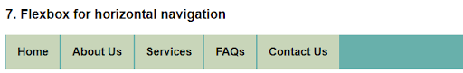

# M2-L3: CSS Flexbox

The goal of this lab is to help familiarize yourself with `flexbox`. You should not need to modify the `index.html` page, only `index.css`.

In this lab, we will be using **functional** CSS. This focuses on using CSS class names that reflect their functionality. For example, a `.m-20` class might correspond to a `margin` of 20px on all sides, while `.mt-20` would correspond to a `margin-top` of 20px.

---

## 1. Familiarize Yourself with the Code

First, review the provided `index.html` and `index.css` files for this lab, paying close attention to the existing class names and the HTML element structure.

---

## 2. Basic Flexbox

1.  Add a CSS rule for the `.flex-container` class to set its `display` property to `flex`.
2.  Add rules for the `.flex-item-1`, `.flex-item-2`, `.flex-item-3`, and `.flex-item-4` classes. Set a `flex` value for each (e.g., `flex: 1`, `flex: 2`).
3.  Compare how the HTML file looks in a browser before and after your changes. How does the value of the `flex` property affect the size of each item?

---

## 3. Centering with Flexbox

1.  Add a CSS rule for the `.flex-center` class and set values for `justify-content` and `align-items`.
2.  Try out different values for both properties. Your final goal is to center the item within its container both **horizontally** and **vertically**.

---

## 4. Distributing Space

1.  Add a CSS rule for the `.flex-space-between` class and experiment with different values for the `justify-content` property. Observe how the alignment of the flex items changes.
2.  Set the value for `justify-content` to `space-between` to push the elements to the opposite sides of the container, with the leftover space distributed in the middle.

---

## 5. Wrapping Items

1.  Add rules for the `.flex-wrap` and `.flex-basis-50` classes. The container should have `flex-wrap: wrap`, and its child items should have `flex-basis: 50%`.
2.  Observe what happens when you change the `flex-wrap` value to `wrap-reverse`.
3.  Choose a new value for `flex-basis` that makes all four flex items fit on a single line.

---

## 6. Changing Direction

Add a `flex-direction` property to your `.flex-container` rule and observe the behavior when using different values (`row`, `column`, `row-reverse`, etc.).

---

## 7. Building a Navigation Menu

1.  Add CSS for the `.flex-menu` class and its children to make it look like the horizontal navigation menu in the screenshot below.

    

2.  Use the `justify-content` property to align the menu items to the **right**.

3.  Use `justify-content` to align the menu items to the **center**.

4.  Use the `order` property to move the "FAQs" menu item to the end of the list.

5.  Use the `flex-grow` property to divide the total space evenly between each menu item, then center the text within each link.

---

## Resources & Reference

### **Helpful Links**

- [A Complete Guide to Flexbox (CSS-Tricks)](https://css-tricks.com/snippets/css/a-guide-to-flexbox/)
- [CSS Flexible Box Layout (MDN)](https://developer.mozilla.org/en-US/docs/Web/CSS/CSS_flexible_box_layout)

### **Flexbox Property Reference**

Use these common properties as a reference and try out various combinations.

```css
/* Flex Container Properties */
.container {
  display: flex; /* or inline-flex */
  flex-direction: row | row-reverse | column | column-reverse;
  flex-wrap: nowrap | wrap | wrap-reverse;
  justify-content: flex-start | flex-end | center | space-between | space-around
    | space-evenly;
  align-items: stretch | flex-start | flex-end | center | baseline;
  align-content: flex-start | flex-end | center | space-between | space-around |
    stretch;

  /* Shorthand for flex-direction and flex-wrap */
  flex-flow: < 'flex-direction' > < 'flex-wrap' >;
}

/* Flex Item Properties */
.item {
  flex-grow: <number>; /* default 0 */
  flex-shrink: <number>; /* default 1 */
  flex-basis: <length> | auto; /* default auto */
  order: <number>; /* default 0 */
  align-self: auto | flex-start | flex-end | center | baseline | stretch;

  /* Shorthand for flex-grow, flex-shrink, and flex-basis */
  flex: none | [ < 'flex-grow' > < 'flex-shrink' >? || < 'flex-basis' >];
}
```

---
