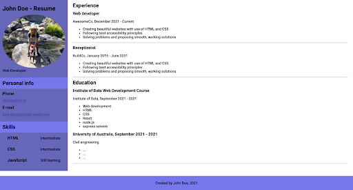

# M2-L4.HTML-CSS: Build Your Own Resume Webpage

In this lab, you will build an entire webpage from scratch to serve as a basic resume. You can use either real or invented details. 🛠️

Use all the skills that you’ve learned so far, including:

- Semantic HTML
- Creating distinct sections
- `flexbox` for layouts, centering, and spacing
- Images and setting `border-radius`
- The box model (setting `margin`, `padding`, `width`, and `height`)
- Styling text
- Styling links

For example, your final resume page might look something like this:

