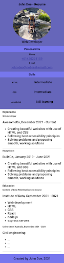

# M2-L5: Build a Responsive Webpage

In this lab, you will add `media queries` to the resume webpage you created in the previous lab to make it responsive. 📱

Use the device toolbar in your browser's **Developer Tools Inspector** to emulate smaller devices like phones. Your goal is to adjust the CSS so the website looks good on all screen sizes and doesn’t require horizontal scrolling.

You may need to consider:

- Changing the `font-size` for smaller screens
- Changing the `flex-direction` from `row` to `column`
- Adjusting other `flexbox` parameters and text alignment

For example, your final responsive website might look something like this on a mobile device:

